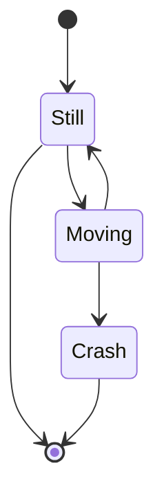
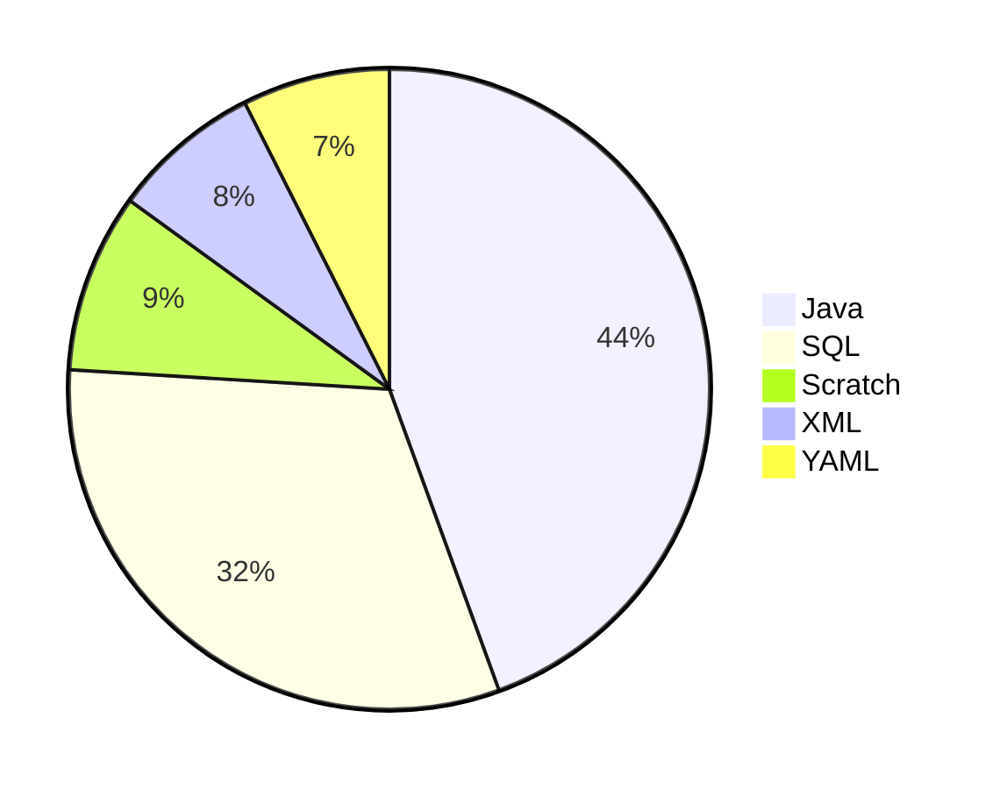

# maven-test

## 介绍
> 各种相关不相关
1. rabbitMq
2. 响应式编程
3. redis集群模式
```shell script
docker-compose up -d;
# 注意修改ip
redis-cli --cluster create 172.19.0.3:7001 172.19.0.4:7002 172.19.0.2:7003
```
# mermaid test


